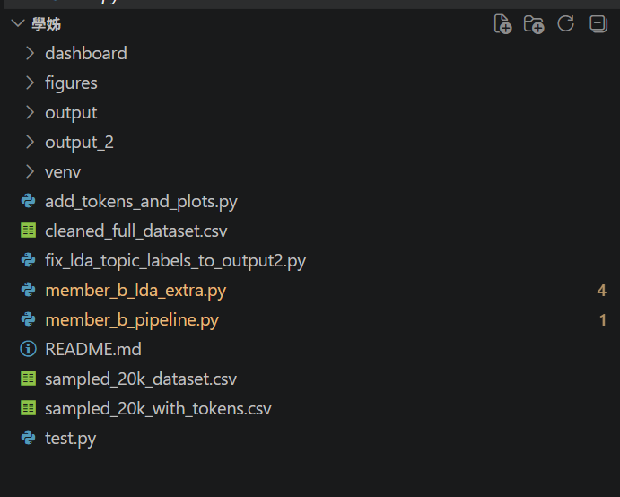

# Airline-Review-Text-Mining
網頁文字探勘
member A、member B的所有操作敘述內容皆在文件說明資料夾中(兩個docx)。
目前所有程式碼、結果等等都在學姊這個資料夾中。
以下是cleaned_full_dataset.csv的下載網址(我放雲端，因為檔案太大，放不上Github):
https://drive.google.com/drive/folders/17LaAqyuTrSRSHajfMrWCw6hYqIu0xBUi?usp=drive_link
# Airline Reviews Text Mining Dashboard
## Project Folder Structure
目前專案資料夾結構如下：
```text
學姊/
├── dashboard/
├── figures/
├── output/
├── output_2/
├── venv/
├── add_tokens_and_plots.py
├── cleaned_full_dataset.csv -> 請從上方雲端連結下載
├── fix_lda_topic_labels_to_output2.py
├── member_b_lda_extra.py
├── member_b_pipeline.py
├── README.md
├── sampled_20k_dataset.csv
├── sampled_20k_with_tokens.csv
└── test.py

